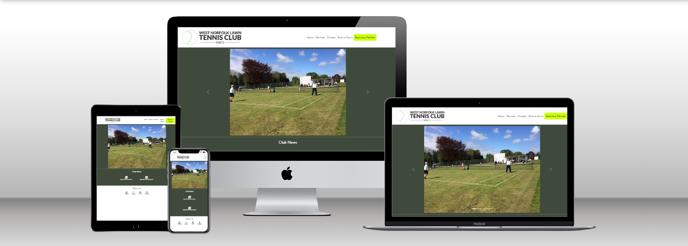

# Milestone Project 1 - West Norfolk Lawn Tennis Club website

Welcome to my first milestone project with the Code Institute. The purpose of this project is to demonstrate the skills and knowledge I have learnt so far in the form of a static website, built with HTML and CSS and using Bootstrap as a framework. Please find my deployed site [here](https://clawrence00.github.io/milestoneproject1/).

---

## Technologies used
- HTML5
- CSS3
- Balsamiq
- Bootstrap 5.3.0
- Font Awesome

---

## UX & UI
### Project Goals
The project goal is to create a static website that is responsive, accessible and coherent to the user. The webpages will have a clear design structure that will be consistant for all pages. This will allow the user of the website to navigate the pages intuitively.

### Customer Goals
The customer in this scenario is a local tennis club. The tennis club wants to increase it's online presence in order to improve member numbers and promote various tournaments that are held at the club over the year. The website will give prospective members information about the club (history, facilities, contact information) and make it simple to enquire about a membership. The clubs activities and events will also be shared through the website further showcasing the attractiveness of membership. The club would want members to be able to manage their own memberships online, including payment, and create court bookings however this is not within the scope of this release. Currently court bookings are performed through a third party site, ClubSpark, and memberships are submitted by filling out paper forms. Using a third party site incurs charges for one-off guest fees and memberships fees.

### Features
In order to create an easy to use website a navigation bar will be accesible at the top of the page with links to various pages. This navigation bar may be too large for smaller screens therefore it will be made to collapse for mobiles. A carousel of the club's photos will be displayed to allow a new user, at first landing on the page, to cycle through. A welcome section and a news section will also feature on the home page, with the latter linking to other pages and articles dedicated to that news item. The footer of the webpage will include icons for various social media accounts.

### User Stories
#### As a member of the club
- I want to be able to access the latest news about the club, emails get lost in my inbox or unintentionally deleted.
- I want to be able to manage my membership online rather than using a paper form.
- I want to be able to book courts online to ensure that the facilities are available when I want to play.
#### As the chairman of the club
- I want to increase the number of members by showing off what the club has to offer.
- I want the website to make it as easy as possible for potential new members to sign up to the club.
- The website design must appeal to all members, young and old.
- I want information about the club available for potential new members.
- I want the website to look professional, giving the club a feel of quality.
#### As a potential new member
- The website should give me all the information I need and promote the club in a way that makes me want to become a member.
- I want an easy way of signing up, giving me instant access to the club and all of it's available facilities.

### Wireframes
Before any code was written wireframes were created using [Balsamiq](https://balsamiq.com/) for each page on three different screen sizes; mobile, tablet and desktop.

#### Mobile Design
- [Home](https://github.com/clawrence00/milestoneproject1/blob/main/documentation/wireframes/mobilehome.png)
- [About](https://github.com/clawrence00/milestoneproject1/blob/main/documentation/wireframes/mobileabout.png)
- [Facilities](https://github.com/clawrence00/milestoneproject1/blob/main/documentation/wireframes/mobilefacilities.png)
- [Contact](https://github.com/clawrence00/milestoneproject1/blob/main/documentation/wireframes/mobilecontact.png)
#### Tablet Design
- [Home](https://github.com/clawrence00/milestoneproject1/blob/main/documentation/wireframes/tablethome.png)
- [About](https://github.com/clawrence00/milestoneproject1/blob/main/documentation/wireframes/tabletabout.png)
- [Facilities](https://github.com/clawrence00/milestoneproject1/blob/main/documentation/wireframes/tabletfacilities.png)
- [Contact](https://github.com/clawrence00/milestoneproject1/blob/main/documentation/wireframes/tabletcontact.png)
#### Desktop Design
- [Home](https://github.com/clawrence00/milestoneproject1/blob/main/documentation/wireframes/desktophome.png)
- [About](https://github.com/clawrence00/milestoneproject1/blob/main/documentation/wireframes/desktopabout.png)
- [Facilities](https://github.com/clawrence00/milestoneproject1/blob/main/documentation/wireframes/desktopfacilities.png)
- [Contact](https://github.com/clawrence00/milestoneproject1/blob/main/documentation/wireframes/desktopcontact.png)

### Design Choices
The website is for a tennis club that will be used by people of different ages and must have a professional quality to it. The following design choices have been made based on this.
#### Font
The font used is Gill Sans. This fits in with the logo font and has a modern feel.
#### Icons
The icons used are from the font awesome free library. As no brand icon for ClubSpark was available a bolt was used in it's place that closely resembles the ClubSpark logo.
#### Colours
To ensure the website has a clean look, minimal use of colour was applied. A dark green/grey was used along with contrasting white. The colour for the  sign up 'Become a Member' button was chosen based on the colour of the tennis ball. The famous yellow-green tennis ball colour is called _optic yellow_ and it's hex color code is #ccff00. The colour really stands out on the page against the minimal background colours.
#### Styling
A carousel is used on the home page showcasing all images used in the website. Excluding the navbar, which spans across the entire width of the page, all other containers are centered on the page whcih gives a good looking, coherent design across multiple device screen sizes.
The active nav-item has had the border CSS from Bootstrap's 'btn' class applied to give it the same look as the sign up button.
#### Images
The images have been taken from the club's [Facebook page](https://www.facebook.com/groups/305550273422129). Permission to use them was given by the page's admin, Jeremy Hodges.

---

## Credits
### Code
- Bootstrap was the source for several pieces of code.
  - [The navbar with a brand name shown on the left and toggler on the right.](https://getbootstrap.com/docs/5.3/components/navbar/#how-it-works)
  - The [carousel](https://getbootstrap.com/docs/5.3/components/carousel/) used on the homepage. The carousel inner was then repeated on other pages where the same images were used to maintain consistency in positioning and size.
  - The transition CSS used in the bootstrap class for the navigation links was copied and used for the footer social media links.
- W3 schools was used for multiple code.
  - The social media buttons were created with this [how to](https://www.w3schools.com/howto/howto_css_social_media_buttons.asp).
  - The [telephone formatting](https://www.w3schools.com/html/html_form_attributes.asp) in the form on the contact page.
  - [Hiding arrows](https://www.w3schools.com/howto/howto_css_hide_arrow_number.asp) from the form field for the BTM no on the contact page.
- The CSS for the reponsive Google map was taken from Olympia Caswell's [post](https://blog.duda.co/responsive-google-maps-for-your-website) (Duda blog post).
- The dark green/gray colour was chosen from the 'classy palette' from [mycolor.space](https://mycolor.space/?hex=%23009B14&sub=1). An initial rich green colour was chosen from a colour picker with colour palettes eing generated by the website.
- The colour code for the 'Become a Member' button was chosen as it was based on the famous tennis ball colour. [This article](https://courts.club/they-are-green-they-are-yellow/#:~:text=Optic%20yellow.,makes%20it%20RGB%20223%2C255%2C79.) by Nicholas Fox Weber (Courts magazine) provided the detail for the colour name and hex code.
- The interactive Google map was added using [Google's documentation.](https://developers.google.com/maps/documentation/embed/get-started)
### Media
- Photograph images are credited to the West Norfolk Lawn Tennis Club's [Facebook page](https://www.facebook.com/groups/305550273422129). Permission to use the images was given by the page's admin, Jeremy Hodges.
- The logo image was created by myself using the website https://www.logoai.com.
- Icons from [Font Awesome's](https://fontawesome.com/) free library have been used throughout the project.
### Content
The following pages were used to create the content for the about page;
 - https://clubspark.lta.org.uk/WestNorfolkLawnTennisClub
 - West Norfolk Lawn Tennis Club's [Facebook page](https://www.facebook.com/groups/305550273422129)
 - http://www.runctonweb.co.uk/tennis/index.html

 ---
 
## Testing
The project has been tested througout developement using Chrome DevTools. The tool was used to emulate an iPhone SE, XR and 12 pro, an iPad Air and also used with the desktop to change screen widths from 1669px and below.
### Bugs & Fixes
- During the development of the footer and social media links it was found that the word 'ClubSpark' was bold. This was due to the font weight used by Font Awesome for the icon. To fix this the font weight for divs in the footer were styled to be 400 (normal).
- The transition CSS from bootstraps nav-links was added to the social media links. When hovering over a circle border appears but after adding the transition when moving the cursor off the link the border transitioned to a square which looked odd. The fix for this was to add a border radius, width and height to the none-hover CSS for the social links. This also fixed an issue where the hover function would make it appear that the social link was pushing the other links aside, again this was due to the social link not have a width or height when not in a hover state.
- In mobile view the navigation menu toggler button would move to the next line, underneath the logo. This was intended to stay on the same line. The fix for this was to add the class _flex_nowrap_ to the div that contains the logo and toggler. This brought a new issue to the page, when the toggle button was pressed the menu would then stay on the same line. The entire nav bar was wrapped in a div with the class _container-fluid_ which solved the issue.
- Following deployment one image would not load in the index page carousel and on the about page. This was due to a file path error where a forward slash was added before the file path. The code was copied from the index page to the about page, therefore copying the error. The file path was corrected and the image now works on both pages.
- Again, following deployment, the 'Become a Member' button did not work. This was due to a bad file directory path in the navigation link. Correcting this solved the issue.
### Validation
Markup validation has been performed on all pages using the [W3C markup validation service](https://validator.w3.org/).  Several issues occurred on the pages. The newsletter PDF documents file names required renaming as they contained spaces which can cause cross-platform issues. Duplicate ID names had been found. These were either removed as they weren't necessary or given a unique ID.

CSS validation has been performed using the [W3C CSS validation service](https://jigsaw.w3.org/css-validator/). No issues were found.

Chrome Lighthouse was used to assess performance of the contact page (in mobile form) which contains a iframe of an interactive map from Google. Two accessibility issues were observed. The iframe containing the Google map did not contain a title. This was a simple fix and the iframe now contains a descriptive title. The second was that the social links in the footer used contained _aria-hidden=true_ within the `<a>` tag. This would hide the the element from any screen readers, including the child `
`. This was removed as it was unecessary and negatively impacting the accessibility.

All evidence of the validation can be found in the [validation](https://github.com/clawrence00/milestoneproject1/blob/main/documentation/validation) folder.

---

### Deployment
The website was deployed using GitHub Pages. Here are the following steps required to **deploy the site**;

1) Select the repository.
2) In the repository navigation click 'Settings'.
3) In the list on the left, under 'Code and automation' select 'Pages'.
4) Under 'Build and deployment', 'Source' should be 'Deploy from branch'.
5) Under 'Build and deployment', 'Branch' select 'main'. The folder should be /(root). Click 'Save'.

Your site should now be live and hosted by GitHub Pages. It may take a minute or two for the site to become available.

To **clone this repository**;

1) on GitHub.com select the main page of the repository.
2) Click the green 'Code' button.
3) Select HTTPS. Click the clipboard icon to copy the repository URL.
4) Create a location on you machine where you want the repository to be cloned.
5) Using Git Bash change the working directory to the location where you want the repository to be cloned.
6) Type _git clone_ and paste the URL of the repository, copied in step 3.
7) Press enter. A local clone has now been created on your machine.  
